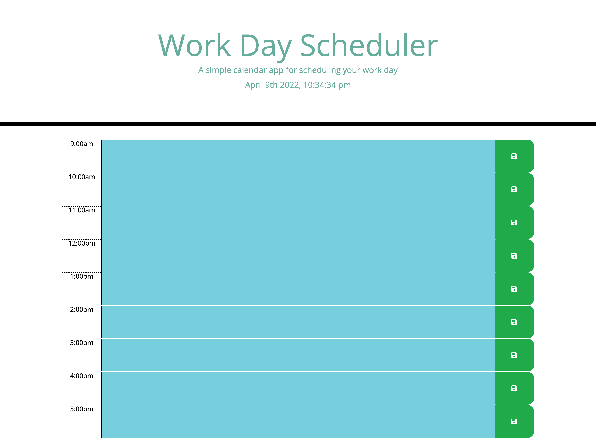

# A Work Day Scheduler
Everyone has needed some kind of agenda where they can keep track of their tasks. Whether you are a student or working, you might find using a  schedule can help keep you more organized. That is why I created this work day schedule to help someone keep themselves a bit more organized! This challenge was given to me for the UCF Coding Bootcamp, so I tried to input as much as I could from what I have learned so far.

# Here is the ask for the challenge:
AS AN employee with a busy schedule
I WANT to add important events to a daily planner
SO THAT I can manage my time effectively

# Here is the criteria to follow for the challenge:
GIVEN I am using a daily planner to create a schedule
WHEN I open the planner
THEN the current day is displayed at the top of the calendar
WHEN I scroll down
THEN I am presented with timeblocks for standard business hours
WHEN I view the timeblocks for that day
THEN each timeblock is color coded to indicate whether it is in the past, present, or future
WHEN I click into a timeblock
THEN I can enter an event
WHEN I click the save button for that timeblock
THEN the text for that event is saved in local storage
WHEN I refresh the page
THEN the saved events persist

[Live Link](https://haileyrb25.github.io/workday_Scheduler/)
Click this link to see this application in action! You should be able to see the current ticking time at the top, along with the work day schedule (8am-5pm) at the bottom with editable changes you can fill out to save on your scheduler!

[Live Link](https://github.com/haileyrb25/workday_Scheduler)
Click this link to see my github activity for this repository! Here, you should be able to see any commits made and how this project came to life.

Here is what the final product looks like:
